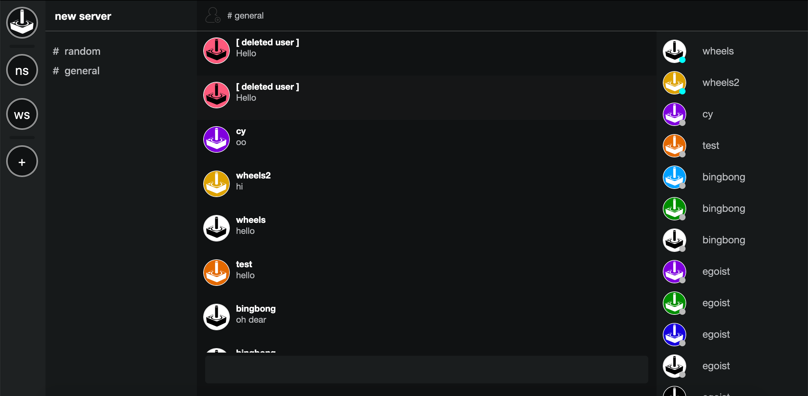

# Dissonance

Basic Discord clone [WIP]

Pull Requests are welcome!

View it live at: https://dissonance.page/join/PGwQuWer

Screenshot(s):



## Current Features

 - [x] Two channels
 - [x] Invite new users to a server
 - [x] Realtime communication
 - [x] Create Servers

## Future (planned) Features

 - [ ] Create Channels
 - [ ] Direct Messaging System
 - [ ] Role System
 - [ ] Configurable Servers
 - [ ] Modify your information (as a user)
 - [ ] Leave Servers
 - [ ] Delete Servers

## Setup

### How to install the project dependencies

1. Create and configure a MongoDB instance which you can read/write to
2. In your Terminal or Command Prompt, run the following at the root of the
project directory:

```
$ npm i --save
```

### How to configure the environment variables

1. Create a `.env` file, by renaming the provided `.sample.env`
2. Add the MongoDB connection url, port, environment name, and other secrets to
the `.env` file

If you set `ENV` to `prod`, you will need to set up a https certificate via
`CERT_FULL_CHAIN_PATH` and `CERT_PRIVATE_KEY_PATH`

If you set `ENV` to something other than `prod` (i.e. `dev`), you will need to set  `CERT_FULL_CHAIN_PATH` and `CERT_PRIVATE_KEY_PATH` to a random string (so the
environment variable is defined)

### How to run the project using NodeJS

In your Terminal or Command Prompt, run the following at the root of the
project directory to run the server, which will expose an API and the client:

```
$ npm start
```

### How to build the project using Docker

1. Change the port which the server will run on, by default it is
port 3000
2. In your Terminal or Command Prompt, run the following at the root of the
directory to build the server and tag it `dissonance`:

```
$ docker build --tag  dissonance .
```

### How to run the project using Docker

In your Terminal or Command Prompt, run the following to run the server, which
will expose the service on port 3000
if you have the a `.env` file:

```
$ docker run -t -p 3000:3000 --env-file ./.env dissonance
```

Or run the following in Terminal/Command Prompt to define custom environment
variable(s)

```
$ docker run -p 3000:3000 -e PORT=3000 -e ENV=dev ... dissonance
```

### How to clean up the source code

In your Terminal or Command Prompt, run the following at the root of the
project directory:

```
$ ./node_modules/.bin/eslint . --fix
```
